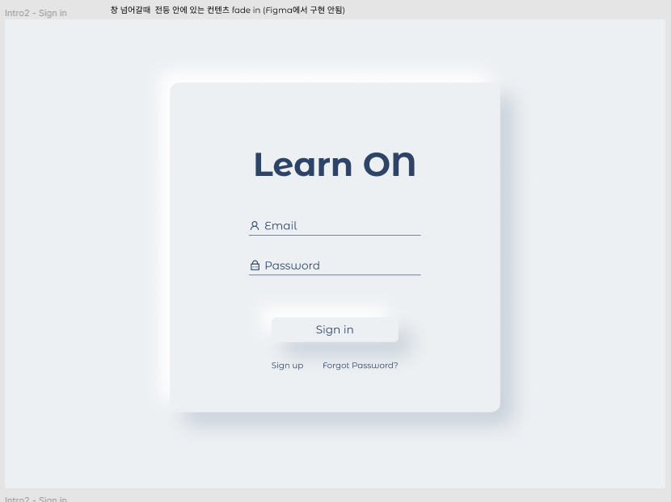

Learn-ON
==========
AI-based online re-education assistent
 

<h3> 1. R&R </h3>

|  
Name
 |  
Major
 |  
Roll
 |
|:--------|:--------:|--------:|
|**bob.siunn** | 
BA & CS 
 |Data selection and engineering |
|**Yongwook Lee** | 
CS 
 |UIUX design and front end developer |
|**Lee Jeong Min** | 
CS 
 |Server deployment and link |
|**skyriver228** | 
Biomedical Convergence Engineering 
 | ML Modeling |
|**Sarah Son** | 
BA 
 | Data collecting and documentation |

<h3> 2. Introduction </h3>

# Service background  

코로나 19 이후 거리두기가 실행되면서, 오프라인으로 이루어지던 학습의 대부분이 온라인 강의로 전환되고 있습니다.  
그 결과, 많은 교수자들은 새로운 플랫폼에서 강의를 어떻게 전달해야 할지, 어떻게 하면 심층적인 학습이 가능할지를 고민해야 하는 상황에 놓였으며,  
학습자들 역시, 오프라인에서 교수자에게 직접 질의를 하기 어려운 환경, 학습의 집중도 측면의 이슈로 인해 어려움을 겪고 있습니다.  
  
이러한 변화는 교육 시장 각지에서 큰 영향을 가져오고 있지만, 그 중 가장 많은 변화를 겪고 있는 것은 대학 강의입니다.  
소위 입시 시장이라고 불리는 중고등 교육 강의는 여러 대형 학원들을 중심으로 인터넷 강의의 플랫폼이 코로나 19 이전에도 빈번히 활용되었습니다.  
그렇기에, 코로나 19로 인한 변화에도 유연하게 대응하며 온라인으로 학습이 이루어짐에도 학생들의 심층적인 학습을 유도할 수 있는 커리큘럼과 학습 방식을 발빠르게 제공하고 있습니다.  
  
하지만 대학 강의의 경우에는 그 사정이 다릅니다.  
대학 기관 자체가 사교육 시장과 달리 시장의 수요에 민감하게 반응하지 않는 특성을 가지고 있음은 물론이고,  
교수자의 평균적인 연령대가 높아 온라인 플랫폼의 활용 능력이 상대적으로 아쉬운 점,  
지금까지의 대학 강의가 대부분 오프라인의 형식으로 제공되어 학습자 역시 온라인 강의를 통한 학습의 효율성에 대해 아쉬움을 느끼는 등의 다양한 이슈들이 존재하는 상황입니다.  
  
이렇게 열악한 상황에도 불구하고, 국내 40%이상 대학이 2020년 전면 온라인을 실시된 이후 지속됨에 따라 코로나가 끝난 이후에도 100% 오프라인 강의의 형태로 돌아가기보다는 온라인 강의의 비중을 높은 상태로 유지하는 방향성으로 대학 교육이 이루어질 가능성이 높습니다.  
  
대학 온라인 강의가 교수자와 학습자 모두에게 익숙하지 않은 방식임에도 온라인 강의가 확대될 전망인 것은 그 단점을 상회하는 장점이 비대면 학습에 있기 때문입니다.  
온라인 학습의 장점은 여러 가지가 있으나 그 중 가장 큰 장점은 개인에 학습 성향에 따라 유연한 학습이 가능하다는 점이 있습니다.  
정해진 시간에 학습을 하는 것이 아니라, 오전 오후 등 자신이 편한 시간에, 원하는 시간에 학습을 진행할 수 있다는 자율성.  
그리고 강의를 들을 기회가 한번뿐인 오프라인 강의에 비해 여러 번 들으며 부족한 부분을 복습할 수 있다는 장점이 있습니다.  
  
이처럼, 온라인 학습만이 가지는 장점이 분명 있기에 온라인 강의는 지속적으로 증가할 것이나,  
학습자와 교수자가 모두 그 장점을 충분히 누리기 위해서는 앞서 언급한 단점들이 보완, 혹은 극복될 필요성이 있습니다.  
그렇기에 고봉밥팀은 기존 온라인 학습의 단점을 최소화하면서, 장점을 최대한으로 활용할 수 있는 솔루션을 고민하게 되었습니다.  
  
  
# Pain Point  

온라인 학습의 가장 큰 장점은 재학습이 용이하다는 것이지만, 필요한 부분만 선택적으로 다시 학습할 수 있는 프로세스가 매끄럽게 제공되지않는다는 비효율성이 존재했다.  
긴 학습 영상 중 자신이 궁금한 부분만 선택적으로 다시 재생하여 학습할 수 있는 니즈가 존재하였다.  
또한, 오프라인 학습과는 달리 온라인 학습상에서는 메시지를 통한 질문만이 가능했기에 즉각적인 대답을 기대하기 어렵다.  
교수자와 학습자의 상호작용이 원활하게 이뤄지기 어렵다는 페인포인트 또한 존재하였다.  

# How to solve?

Learn ON은 본질적으로, 코로나 19로 온라인 학습이 불가피해지는 상황에서 온라인 학습이 주는 불편함과 비효율성을 개선하고, 오프라인 학습과는 달리 온라인 학습만이 가지는 장점과 편리성을 극대화하는 것을 목표로 한다.  
재학습의 접근성을 높이고, 맞춤형 학습이 가능하도록 한다.  

# Solution  

Learn ON은 강의 내용 분석을 통해 자동 북마크를 생성해 더욱 편리한 학습을 돕는다.  
뿐만 아니라, 개인이 키워드 입력을 통해 직접 북마크를 생성하여 맞춤형 학습이 가능하도록 돕는다.  
또한, AI조교 도입을 통해 Text Data내에서 가능한 수준으로 대답을 제공하고, 질문에 대한 검색 결과를 정교하게 크롤링해줌으로써 학습자들의 학습이 즉각적이고 심층적으로 이루어질 수 있도록 한다.  

# Expected Effect  

학습자들은 Learn ON을 통해 보다 효과적으로 재학습이 가능하다.  
언제든 긴 강의 영상 중 필요한 부분만을 선택적으로 찾아내어 다시 학습할 수 있으며, 키워드 입력을 통해 자신이 필요한 부분의 타임라인을 검색할 수도 있다.  
원하는 부분을 저장해놓음으로서 이를 여러 번 재학습 하는 효율성을 크게 기대할 수 있다.  
기존 온라인 학습 환경에서는 메시지로만 질문이 가능하여 이에 대한 장벽이 상대적으로 높았지만, AI조교를 통해 부담없이 질문을 통한 학습이 가능해, 온라인 상에서 부족해진 교수자와 학습자 간의 상호작용을 크게 보완할 수 있다.  
