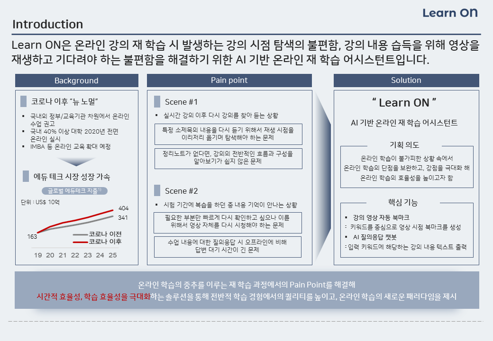

Learn-ON
==========
AI-based online re-education assistent
 

<h3> 1. R&R </h3>

|  
Name
 |  
Major
 |  
Role
 |
|:--------|:--------:|--------:|
|**bob.siunn** | 
BA & CS 
 |Data selection and engineering |
|**Yongwook Lee** | 
CS 
 |UIUX design and front end developer |
|**Lee Jeong Min** | 
CS 
 |Server deployment and link |
|**skyriver228** | 
Biomedical Convergence Engineering 
 | ML Modeling |
|**Sarah Son** | 
BA 
 | Data collecting and documentation |

<h3> 2. Introduction </h3>

Learn ON is a AI-based online re-edcation assistent which can overcome online learner's pain point on E-learning process and maximaize the advantages of online learning. As a result, we provide a new paradigm for E-learning.  
  
  
  
* Vision  
: Learn ON aims to improve the inconvenience and inefficiency of online learning in the face of inevitable online learning with Corona 19, and maximize the advantages and convenience of online learning alone, unlike offline learning.  

* Background  
    * Since Covid 19, most offline lectures have moved to online platforms due to social distancing.
    * As a result, the online learning market has experienced unprecedented growth, and this trend is expected to continue even after the end of the Korona 19 crisis.
    * The reason why online learning is so welcomed by learners is that learners can listen to lectures at any time, watch videos again, and re-learn at any time they want.
    * However, there are some unresolved pain points in current online learning.
    * When they have questions while they are in the process of learning, they have to wait a lot of time to get answers, and they do not know at what point they want to check again during the re-learning, which takes inefficient exploration time.  
  
* Why AI?
    * By introducing ai to analyze lecture videos, you can check the overall course flow without having to check the contents of each person.
    * By introducing NLP and STT models in open source or api form to handle online lecture videos that are subject to the service, we can efficiently deliver the desired utility to users.
    * Online lecture video data is expected to perform well in NLP as the flow of lectures is consistent and specific terms act as an index of the flow of lectures and simultaneously separate contexts.
    * In addition, due to the nature of data for information delivery, the quality of STT results is good because of the accurate pronunciation.
  
  
# Pain Point  

온라인 학습의 가장 큰 장점은 재학습이 용이하다는 것이지만, 필요한 부분만 선택적으로 다시 학습할 수 있는 프로세스가 매끄럽게 제공되지않는다는 비효율성이 존재했다.  
긴 학습 영상 중 자신이 궁금한 부분만 선택적으로 다시 재생하여 학습할 수 있는 니즈가 존재하였다.  
또한, 오프라인 학습과는 달리 온라인 학습상에서는 메시지를 통한 질문만이 가능했기에 즉각적인 대답을 기대하기 어렵다.  
교수자와 학습자의 상호작용이 원활하게 이뤄지기 어렵다는 페인포인트 또한 존재하였다.  

# How to solve?

Learn ON은 본질적으로, 코로나 19로 온라인 학습이 불가피해지는 상황에서 온라인 학습이 주는 불편함과 비효율성을 개선하고, 오프라인 학습과는 달리 온라인 학습만이 가지는 장점과 편리성을 극대화하는 것을 목표로 한다.  
재학습의 접근성을 높이고, 맞춤형 학습이 가능하도록 한다.  

# Solution  

Learn ON은 강의 내용 분석을 통해 자동 북마크를 생성해 더욱 편리한 학습을 돕는다.  
뿐만 아니라, 개인이 키워드 입력을 통해 직접 북마크를 생성하여 맞춤형 학습이 가능하도록 돕는다.  
또한, AI조교 도입을 통해 Text Data내에서 가능한 수준으로 대답을 제공하고, 질문에 대한 검색 결과를 정교하게 크롤링해줌으로써 학습자들의 학습이 즉각적이고 심층적으로 이루어질 수 있도록 한다.  

# Expected Effect  

학습자들은 Learn ON을 통해 보다 효과적으로 재학습이 가능하다.  
언제든 긴 강의 영상 중 필요한 부분만을 선택적으로 찾아내어 다시 학습할 수 있으며, 키워드 입력을 통해 자신이 필요한 부분의 타임라인을 검색할 수도 있다.  
원하는 부분을 저장해놓음으로서 이를 여러 번 재학습 하는 효율성을 크게 기대할 수 있다.  
기존 온라인 학습 환경에서는 메시지로만 질문이 가능하여 이에 대한 장벽이 상대적으로 높았지만, AI조교를 통해 부담없이 질문을 통한 학습이 가능해, 온라인 상에서 부족해진 교수자와 학습자 간의 상호작용을 크게 보완할 수 있다.  
